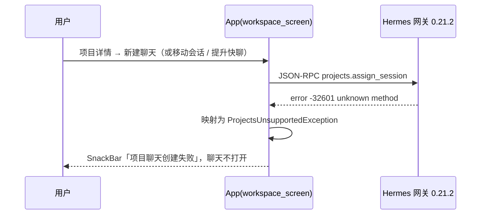
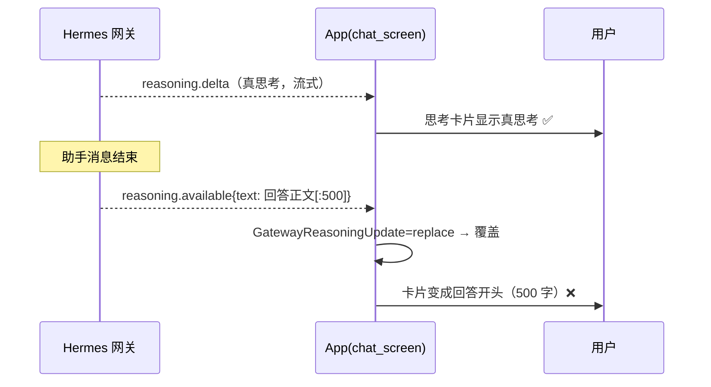
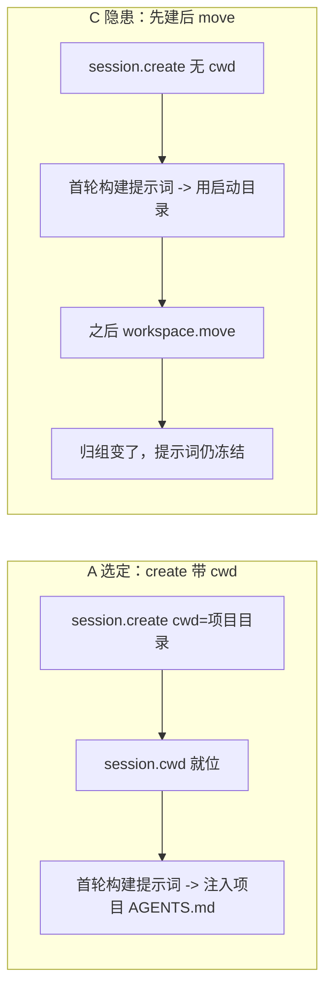
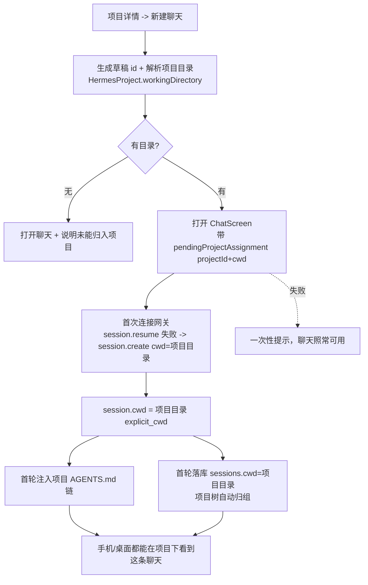
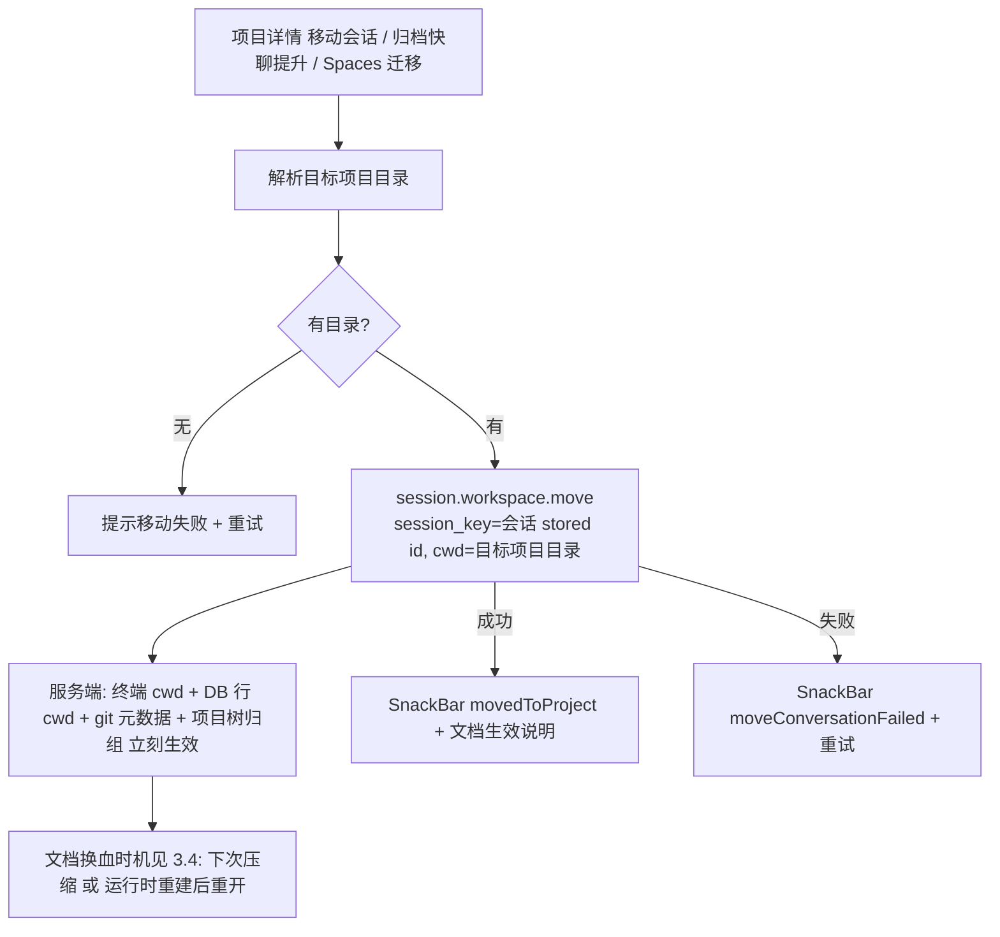

# Hermes Android：思考过程显示 + 项目聊天归组 修复计划（v4 定稿待审）

> **For Hermes:** 待用户审核通过后按本计划逐任务实施；实施用 TDD，任务粒度 2–5 分钟。
>
> **变更史**：v1 初稿（含"先建会话再 move"的弱方案）→ v2 新建项目聊天改 **create 时带 cwd**（与桌面端等价）→ v3 核实「移动已有会话」的文档换血时机 → **v4 定稿**：移动已有会话统一用 `session.workspace.move`，**App 全面停用 `projects.assign_session`**，整理章节、去矛盾、修编号。

**Goal:** ① 项目内「新建聊天」不再失败，且**从第一轮起就带项目上下文（项目 AGENTS.md 链）**；② 「把已有会话移进项目」在同一批里修好（走官方 `session.workspace.move`）；③ 回合结束后思考块保留真思考，不再被回答前 500 字覆盖。

**Architecture:** 全部是**纯 Android 侧**改动，不碰 Hermes 源码。归组只用官方两条机制：**新建 = `session.create {cwd}`**、**移动 = `session.workspace.move {session_key, cwd}`**；项目归属由服务端按会话 cwd 推导，App 不再调用不存在的 `projects.assign_session`。

**Tech Stack:** Flutter 3.x / Dart 3.12、gen-l10n（ARB）、WebSocket JSON-RPC（Desktop Gateway `/api/ws`）、REST API Server（8642）。

---

## 0. 决策记录（已定，供审核核对）

| # | 决策 | 内容 | 依据 |
|---|---|---|---|
| D1 | 新建项目聊天机制 | `session.create {cwd: 项目目录}`（会话出生即锚定） | 桌面端同款：`use-session-actions/index.ts:553-577`；服务端 `_completion_cwd`（`session_workdir.py:23-35`） |
| D2 | 移动已有会话机制 | `session.workspace.move {session_key, cwd}`，**唯一机制** | 用户 2026-09-13 拍板（语义清晰）；官方唯一实现（`methods_session.py:875`） |
| D3 | `projects.assign_session` | **全面停用**（含 Spaces→Projects 迁移写路径） | 官方从未实现（第 1 节证据）；保留它只会让"作者契约 vs 官方契约"两套语义并存 |
| D4 | commit-before-open 语义 | 改：不再"写失败就不开聊天" | 用户批准（v2） |
| D5 | 思考块策略 | 丢弃"实为回答摘要"的 `reasoning.available` | 用户批准（v2） |
| D6 | 文案 | 新增 2 条 ARB key，其余复用现有 key | 铁律：新增 UI 文案必须走 `context.l10n` |

**范围外（本次不做）**：重进会话回看历史思考（②-A2，服务端已存 `messages.reasoning`，可另排期）、Hermes 服务端任何改动、上游 merge、`stored_session_id` 身份统一改造。

---

## 1. 问题与根因（均已真机取证）

### ① 项目内「新建聊天」→「项目聊天创建失败」（移动已有会话是同一个病）



真机日志（debug + 临时埋点，已回退）：

```
DIAG _finishNewChat projectId=p_3bc0abd4 repoNull=false support=ProjectsSupport.native draftId=mob-17789272593533-…
DIAG assign failed: ProjectsUnsupportedException(projects.assign_session): unknown method: projects.assign_session
```

根因：`projects.assign_session` 是 App 自定契约，**官方 Hermes 从未实现**：
- 官方 `projects.*` 注册全集（`tui_gateway/methods_projects.py`）：list / get / create / update / add_folder / remove_folder / set_primary / archive / delete / set_active / for_cwd / tree / project_sessions / discover_repos / record_repos。
- 全仓 33752 个 commit 的 pickaxe（`git log --all -S assign_session`）零命中；安装目录（editable 0.21.2）零命中。
- `hermes_cli/projects_db.py` 无任何 session 列——项目归属**按会话 cwd 推导**（`project_for_path` + `tui_gateway/project_tree.py`）。

Android 侧所有走这条死路的入口（本次全部要改）：

| 入口 | 位置 |
|---|---|
| 项目详情「新建聊天」 | `workspace_screen.dart:1010`（`_finishNewChat`）+ `:1075`（重绑） |
| 项目详情「移动会话」 | `workspace_screen.dart:838`（`onMoveSession`） |
| 归档快聊「提升到项目」 | `workspace_screen.dart:1177`（`_promoteQuickChat`） |
| Spaces→Projects 迁移写路径 | `projects_repository.dart:521`（`migrateSpaces`） |

### ② 回合结束后思考块被"回答前 500 字"覆盖



- 服务端 `agent/turn_response_intake.py:98-112`：`_relay_thinking(agent, assistant_message.content)` → `tool_progress_callback("reasoning.available", "_thinking", text[:500])`（转发 `tui_gateway/tool_progress.py:306`）——**payload 是回答正文，不是思考**。
- App `gateway_insight.dart:29-31`：`reasoning.available` → `replace`；`reasoning.delta` → `append`。调用点 `chat_screen.dart:2184-2192`。
- 真机实证：展开的 `GatewayReasoningCard` 内 Text 长度为 **500**，内容 = 回答开头。
- **不是汉化回归**：i18n overlay 对相关三文件的 merge-base diff 只有 l10n import + 思考力度标签本地化。

---

## 2. 目标行为对比

| 场景 | 现状 | 目标（v4 定稿） |
|---|---|---|
| 项目内新建聊天 | 失败，聊天不打开 | 聊天打开；**会话出生即锚定项目目录**（`session.create {cwd}`） |
| 新建聊天的项目上下文 | 无 | ✔ 第一轮构建系统提示词时就注入项目 AGENTS.md 链（依据 3.1） |
| 新建聊天归组 | 无 | ✔ 会话行 `cwd` = 项目目录 → 服务端树自动归到该项目（桌面端同见） |
| 移动已有会话（项目详情移动 / 快聊提升 / Spaces 迁移） | 失败 | ✔ `session.workspace.move`：工作目录、终端、项目树归组**立刻**生效 |
| 移动后的项目文档 | — | 不热切；等该会话**下次压缩上下文**或**运行时重建后重开**才加载（依据 3.4），UI 如实说明 |
| 项目无目录 / 连接无 WS | 失败 | 聊天照常打开 + 一次性说明"未能归入项目" |
| 回合结束后的思考块 | 被回答前 500 字替换 | 保留流式真思考 |
| `reasoning.delta` / 其他事件 | 正常 | 不变 |

---

## 3. 机制核实（逐条源码证据，v0.21.2）

### 3.1 项目文档注入的时机

| 环节 | 位置 | 事实 |
|---|---|---|
| 项目文档（AGENTS.md 链）在哪读 | `agent/system_prompt.py:585-597` `_context_files_part` → `build_context_files_prompt(cwd=resolve_context_cwd())` | 读 `resolve_context_cwd()` |
| cwd 从哪来 | `agent/runtime_cwd.py:75-94` | `resolve_context_cwd()` / `resolve_agent_cwd()` **都优先读 `${_SESSION_CWD}`**（ContextVar 会话级 pin） |
| pin 谁写的 | `gateway/session_context.py:292`（`set_session_vars` 内 `_runtime_cwd("set_session_cwd", cwd)`） | 网关**每轮开始**用 `session["cwd"]` 绑定（`tui_gateway/methods_prompt.py:940`；`tui_gateway/server.py:1215`） |
| 系统提示词构建频次 | `agent/turn_context.py:948-950`（`if agent._cached_system_prompt is None` → `_restore_or_build_system_prompt`）+ `agent/conversation_loop.py:651-753` | **每会话一次**，之后复用（首次构建即 `_persist_system_prompt` 落库） |
| 会话 cwd 何时定 | `tui_gateway/session_workdir.py:23-35` `_completion_cwd(params)` | **`params['cwd']` 最优先** → `session["cwd"]`；`session.create` 收 `cwd`（`methods_session.py:325-345`，`explicit_cwd`） |
| 桌面端建项目聊天怎么发 | `apps/desktop/src/app/session/hooks/use-session-actions/index.ts:553-577`（cwd 来自 `store/projects.ts:161` `projectRootCwd`） | **`session.create` 直接带 `cwd`**，不是建完再搬 |

### 3.2 三种新建做法对比

| 方案 | 项目文档注入 | 项目树归组 | 与桌面端一致 | 结论 |
|---|---|---|---|---|
| **A `session.create {cwd: 项目目录}`** | ✔ 首轮即注入 | ✔ | ✔ 逐字一致 | **选定（D1）** |
| B 先 create（无 cwd）→ 首轮前 `workspace.move` | 仅当 move 早于首轮 | ✔ | ✘ | 否决：与首轮竞态 |
| C 先 create → 多轮后 move | ✘（提示词已冻结） | ✔ | ✘ | 否决：用户以为进了项目却无上下文 |



### 3.3 停止使用 `projects.assign_session` 的语义收益

- 归组语义收敛成一句话：**"会话的 cwd 落在项目目录里 → 它属于该项目"**（服务端唯一真源，桌面端与手机端一致）。
- 不再有"作者契约（assign）优先 / 官方契约（cwd）回退"的双通道，避免两条路径产生**不同的 cwd 语义**（assign 不改 cwd，所以就算将来官方实现了它，也拿不到项目文档）。
- 兼容性影响（如实记录）：作者自带的 `tools/fake_gateway` 测试桩若实现了 `projects.assign_session`，本 App 将不再调用它——不影响真机使用（真实网关都没有该 RPC）；若将来官方上线等价能力，另开任务评估。

### 3.4 移动已有会话：项目文档什么时候换血

| 时点 | 项目文档 | 证据 |
|---|---|---|
| `session.workspace.move` 本身 | ✘ 不动提示词（只改 `session["cwd"]`、终端 pin、DB 行 cwd、git 元数据、项目树归组） | `methods_session.py:875-911` → `_set_session_cwd`（`session_workdir.py:516-530`） |
| 同一运行时（agent 还活着）后续回合 | ✘ 仍是旧文档 | `turn_context.py:948-950`：`_cached_system_prompt` 非空只复用 |
| 该会话发生**上下文压缩** | ✔ 重建 → 新项目文档注入；压缩同时**轮换 session id 作新容器** | 重建：`conversation_compression.py:3703` `_rebuild_system_prompt_at_boundary`；轮换：同文件 `:1421`/`:2221`（`boundary_reason="compression", old_session_id=…`） |
| 运行时被**真正重建**后的 resume（关掉后重开 / 网关重启 / 换进程接管） | ✔ 重建 → 新项目文档注入 | `conversation_loop.py:814-818` `_stored_prompt_matches_runtime` 把 cwd 当身份字段，比对提示词里 `Current working directory:` 行（`prompt_builder.py:955`） |
| 只是"重开会话"但运行时仍活着 | ✘ 复用旧运行时，不重建 | `methods_session.py:664-686` `_resume_reuse_live`（resume 快路径 reattach） |

**一句话语义（写进 UI 文案与代码注释）**：移动 = 立刻改工作目录 / 终端 / 项目归属；**项目文档要等该会话下次压缩上下文、或运行时重建后重开，才会加载**。既不承诺"立刻带上下文"，也不建议"重开一下就行"。

---

## 4. 目标生命周期

### 4.1 新建项目聊天



### 4.2 移动已有会话



---

## 5. 文件清单（改哪些文件 · 审核重点）

> 全部为 Android 侧文件；`类型`：改 = 修改既有文件，增 = 新建文件。

### 5.1 产品代码

| # | 文件 | 类型 | 改动要点 |
|---|---|---|---|
| 1 | `lib/core/models/gateway_insight.dart` | 改 | 新增纯函数判定：`reasoning.available` 是否"实为回答摘要"（与本条 assistant 正文相同/为其前缀，归一化空白后比对） |
| 2 | `lib/core/screens/chat_screen.dart` | 改 | (a) `_handleDesktopGatewayEvent`（:2178-2195）接入判定，保留真思考；(b) 新增可选参数 `pendingProjectAssignment(projectId, cwd)`，首次连接时交给会话创建；(c) 归组失败的一次性提示 |
| 3 | `lib/core/services/ws_client.dart` | 改 | (a) `createOrResumeSession(sessionId, {cwd})`：`session.create` 按需带 `cwd`（只作用于 create 分支）；(b) 返回值透出 `stored_session_id`；(c) 新增 `moveSessionWorkspace({sessionKey, cwd})` → `session.workspace.move` |
| 4 | `lib/core/services/desktop_gateway_client.dart` | 改 | (a) `ensureSession(sessionId, {cwd})`：仅 create 分支带 cwd；(b) 新增 `moveSessionToProject({sessionKey, cwd})` |
| 5 | `lib/core/services/projects_gateway_client.dart` | 改 | **删除 `assignSession`**（D3）；`_probeMethod` 与 family 判定逻辑保持不变 |
| 6 | `lib/core/services/projects_repository.dart` | 改 | (a) 新增 `folderPathFor(projectId)`（复用 `HermesProject.workingDirectory`）；(b) `assignSession` → `moveSessionToProject(sessionId, projectId)`（统一走 workspace.move）；(c) `migrateSpaces`（:521）改用同一方法；(d) 返回结果区分 `moved / noFolder / unsupported / failed` 供 UI 提示 |
| 7 | `lib/core/screens/workspace_screen.dart` | 改 | (a) `_finishNewChat`：去掉"写失败即 return"死锁，改为"解析目录 + 打开聊天（带 pendingProjectAssignment）"；(b) 删除 `_projectChatBindings` / `_installProjectAssignmentReconcile` / `_reconcileProjectAssignment`（随 assign 路径废弃，无引用后删除）；(c) `_openSession`/`buildWorkspaceChatScreen` 透传 `pendingProjectAssignment`；(d) 移动路径 :838 / :1177 改走 `moveSessionToProject` |
| 8 | `lib/core/widgets/project_detail_screen.dart` | 改 | 移动会话流程的提示接入（成功复用 `movedToProject` + 新增文档生效说明；失败复用 `moveConversationFailed` + 重试） |
| 9 | `lib/l10n/app_en.arb` + `app_zh.arb` + 生成物（`lib/l10n/app_localizations*.dart`） | 改 | 新增 2 条 key（见 5.3）；走 `flutter gen-l10n` 并**提交生成文件** |

### 5.2 测试

| # | 文件 | 类型 | 改动要点 |
|---|---|---|---|
| 10 | `test/gateway_insight_test.dart` | 改 | 回答摘要判定：前缀 / 等值 / 无关文本 / 空正文 |
| 11 | `test/chat_reasoning_replace_test.dart` | 增 | 组件测：先 `reasoning.delta` 再 `reasoning.available(回答[:500])` → 卡片保留真思考 |
| 12 | `test/projects_gateway_client_test.dart` | 改 | 删 `projects.assign_session` 相关用例（:289-351）；新增 `session.workspace.move` 调用形状用例 |
| 13 | `test/projects_repository_test.dart` | 改 | `folderPathFor` 四态（primary_path / is_primary / 首个 folder / 无）+ `moveSessionToProject` 的 moved/noFolder/unsupported/failed 四结果 |
| 14 | `test/projects_pane_test.dart` | 改 | mock RPC 表（:106）里 `projects.assign_session` 换成 `session.workspace.move` |
| 15 | `test/space_migration_write_test.dart` | 改 | 迁移写路径断言改为 `session.workspace.move` |
| 16 | `test/workspace_screen_test.dart` | 改 | 网关不支持 projects.* 时：聊天仍打开、不弹失败、意图被记录；移动路径改走新方法 |
| 17 | `test/project_detail_screen_test.dart` | 改 | 项目详情 FAB（新建聊天）+ 移动会话两条路径的提示与重试 |

### 5.3 文案（新增 2 条，其余复用）

| key（en） | en | zh | 用途 |
|---|---|---|---|
| `projectChatUnfiled` | `Opened as a normal chat — couldn't file it into a project` | `未能把此聊天归入项目，已按普通聊天打开` | 新建聊天归组失败（含无目录 / 无 WS / RPC 失败） |
| `projectMoveContextPending` | `Project files will load after this chat next compresses its context or reopens` | `项目文档将在该会话下次压缩上下文或重新打开后加载` | 移动成功后的语义说明（依据 3.4） |

复用现有 key：`movedToProject`(:874)、`moveConversationFailed`(:930)、`promotedToProject`(:1042)、`promoteConversationFailed`(:1043)、`retry`(:5)。

`createProjectChatFailed`(:1017) 在新设计下不再被引用（新路径总能打开聊天，只有"归入项目"会失败并改用 `projectChatUnfiled`）——**保留 key 不删**（少动上游 ARB，降低 merge 噪音），如要清理另开任务。

**不改**：`pubspec.yaml`（versionCode 2141 别动）、Hermes 源码、`chat_space_store`（本地 Spaces，与项目归组无关）、其他 l10n key、上游 `projects.*` 之外的网关协议。

---

## 6. 任务分解（TDD，逐步提交）

> 每个任务：写失败测试 → 跑（确认失败）→ 最小实现 → 跑（通过）→ commit。
> 跑测试前固定：`export NO_PROXY="127.0.0.1,localhost"; export no_proxy="127.0.0.1,localhost"`（否则 flutter_tester 回环 WebSocket 被代理拦）。

### 任务 1：思考块的"回答摘要"判定（纯函数）
- 文件：`lib/core/models/gateway_insight.dart`、`test/gateway_insight_test.dart`
- 语义（归一化 = 去首尾空白 + 折叠内部空白）：正文非空且（摘要 == 正文 或 正文.startsWith(摘要)）→ 判定为回答摘要；其余不判定（保持 replace）
- 命令：`flutter test --no-pub test/gateway_insight_test.dart` → 先红后绿

### 任务 2：chat_screen 接入判定
- 文件：`lib/core/screens/chat_screen.dart:2178-2195`
- `mode == replace` 且判定为回答摘要 → 丢弃该更新（保留已攒思考）；`append` 路径不动
- 命令：`flutter test --no-pub test/chat_reasoning_replace_test.dart`

### 任务 3：WS 客户端 —— 建会话带 cwd
- 文件：`lib/core/services/ws_client.dart`
- `createOrResumeSession(String sessionId, {String? cwd})`：`session.create` 参数按需带 `cwd`；返回值补 `stored_session_id`
- 命令：`flutter test --no-pub`（`ls test | grep -i ws_client` 确认既有测试文件；无则新建 `test/ws_client_session_create_test.dart`）

### 任务 4：WS 客户端 —— 移动会话
- 文件：`lib/core/services/ws_client.dart`
- 新增 `moveSessionWorkspace({required String sessionKey, required String cwd})` → `session.workspace.move`，错误按现有 `_gatewayResponseError` 规范抛
- 命令：`flutter test --no-pub test/ws_client_workspace_move_test.dart`（新增）

### 任务 5：网关客户端接线
- 文件：`lib/core/services/desktop_gateway_client.dart`
- `ensureSession(sessionId, {String? cwd})`：`_resumeOrCreate` 的 **resume 分支忽略 cwd**（不覆盖已有工作区），create 分支带上；新增 `moveSessionToProject({sessionKey, cwd})`
- 命令：`flutter test --no-pub test/projects_gateway_client_test.dart`

### 任务 6：网关 Projects 客户端去掉 assign
- 文件：`lib/core/services/projects_gateway_client.dart`、`test/projects_gateway_client_test.dart`、`test/projects_pane_test.dart`
- 删除 `assignSession` 与其测试；mock RPC 表（`projects_pane_test.dart:106`）更新
- 命令：`flutter test --no-pub test/projects_gateway_client_test.dart test/projects_pane_test.dart`

### 任务 7：仓库层 —— 单一归组机制
- 文件：`lib/core/services/projects_repository.dart`
- (a) `folderPathFor(projectId)`；(b) `moveSessionToProject(sessionId, projectId)` → 解析目录 → `ws.moveSessionWorkspace`，返回 `moved/noFolder/unsupported/failed`；(c) 删除 `assignSession`（上一步已删客户端方法）；(d) `migrateSpaces`（:521）改用新方法
- 命令：`flutter test --no-pub test/projects_repository_test.dart test/space_migration_write_test.dart`

### 任务 8：workspace 新建路径改造
- 文件：`lib/core/screens/workspace_screen.dart`（`_finishNewChat` / `_startProjectChat` / `_openSession` / `buildWorkspaceChatScreen`）
- 去掉"写失败即 return"；解析项目目录 → 组装 `pendingProjectAssignment`；透传给 ChatScreen；删除已废弃的重绑三件套
- 命令：`flutter test --no-pub test/workspace_screen_test.dart test/project_detail_screen_test.dart`

### 任务 9：workspace/项目详情 移动路径改造
- 文件：`lib/core/screens/workspace_screen.dart:838`（移动会话）、`:1177`（快聊提升）；`lib/core/widgets/project_detail_screen.dart`
- 改走 `moveSessionToProject`；成功 = `movedToProject` + `projectMoveContextPending`；失败 = `moveConversationFailed` / `promoteConversationFailed` + 重试
- 命令：`flutter test --no-pub test/project_detail_screen_test.dart test/workspace_screen_test.dart`

### 任务 10：ChatScreen 应用 pendingProjectAssignment + 文案
- 文件：`lib/core/screens/chat_screen.dart`、`lib/l10n/app_en.arb`、`lib/l10n/app_zh.arb`
- 首次连接时把 cwd 交给 `ensureSession`；失败 → `projectChatUnfiled` 一次性提示；成功后清空待办
- 命令：`flutter gen-l10n` → `flutter analyze --no-pub --fatal-infos` → `flutter test --no-pub`
- 预期：analyze 0 issue；`arb_parity_test.dart` / `zh_smoke_test.dart` 绿

### 任务 11：门禁 + 真机验收（第 7 节）
### 任务 12：提交
- 分两个 commit：`fix: keep real reasoning out of the answer-preview replace`（任务 1-2）与 `fix: file project chats by session cwd`（任务 3-10），便于单独回退
- 提交前 `git status` 核对改动面；`pubspec.lock` 若被 pub 改动用 `git checkout -- pubspec.lock` 清掉

---

## 7. 测试与验收

### 7.1 本地门禁（与 CI 逐字一致）
```bash
export NO_PROXY="127.0.0.1,localhost"; export no_proxy="127.0.0.1,localhost"
flutter gen-l10n                       # 仅当 ARB 有改动
flutter analyze --no-pub --fatal-infos
flutter test --no-pub
```
预期：analyze 0；测试全绿（当前基线 1002 + 新增）。

### 7.2 真机验收（MI 8，debug）
```bash
flutter run -d f9b1e800 --debug        # Dart 日志进 flutter run 控制台（不进 logcat）
# dart MCP: dtd listDtdUris → connect → get_runtime_errors / hot_reload
```

| # | 验收项 | 步骤 | 通过标准 / 取证 |
|---|---|---|---|
| A1 | 新建项目聊天不再失败 | Projects → 进项目 → 新建聊天 | 聊天打开、无失败提示 |
| A2 | 新建即带项目上下文 | 同上，看首轮 | 会话 cwd = 项目目录：`SELECT id, cwd FROM sessions ORDER BY started_at DESC LIMIT 3`（只读打开 `~/.hermes/state.db`）；再让 agent 复述当前工作目录与项目规则文件名 |
| A3 | 归组可见 | 项目详情列表 / `projects.tree` | 新聊天出现在该项目下；桌面端同见 |
| B1 | 移动会话可用 | 项目详情 → 某聊天 → 移动会话 → 选另一个项目 | 成功提示；服务端树把它换到目标项目；`sessions.cwd` 变为目标项目目录 |
| B2 | 移动后文档语义如实 | 同一会话继续对话（未压缩） | 仍是旧文档（符合 3.4）；不做"立刻生效"承诺 |
| B3 | 快聊提升 / Spaces 迁移 | 归档快聊提升到项目 / 迁移预览执行 | 均走 `session.workspace.move`，无 `unknown method` 报错 |
| C1 | 思考块不再被覆盖 | 发一轮消息 → 回合一结束就展开「思考过程」 | 内容是**真思考**；`widget_inspector(summaryOnly:false)` 看卡片内 Text，`textPreview` 长度不再是 500、内容 ≠ 回答开头 |

**本机已知坑**：小米 8 上 `adb shell input tap/keyevent` 被系统拦（`Bad file descriptor` / `SecurityException: INJECT_EVENTS`）→ 需要用户手点；`debugPrint` 只进 `flutter run` 控制台。

---

## 8. 风险、边界与开放问题

| 项 | 说明 | 处置 |
|---|---|---|
| 语义变更（已批准） | 去掉"写失败就不开聊天"的 commit-before-open | "先建会话（带 cwd）再打开聊天"；失败只在无法归组时提示 |
| 停用 `assign_session`（D3） | 作者 `tools/fake_gateway` 若实现该 RPC，本 App 不再调用 | 不影响真机；将来官方若上线等价能力，另开任务 |
| 移动后文档不热切（已核实） | 官方语义，桌面端切项目亦同 | UI 按 3.4 明说（`projectMoveContextPending`） |
| 项目无目录 | `primary_path` 与 `folders` 皆空 | 新建：打开聊天 + `projectChatUnfiled`；移动：失败 + 重试 |
| REST-only 连接 | 无 WS 时无法 create-with-cwd / move | 同样是降级提示（现有连接已配 WS） |
| 移动路径的 id 形态 | `session.workspace.move` 要 `session_key`（stored id） | 移动入口的会话都来自服务端列（stored id）；新建路径不受影响 |
| 路径形态 | 服务端目录可能是 Windows/WSL 路径 | 原样回传（服务端 `translate_cwd_for_wsl_backend` 处理） |
| 删除重绑三件套 | 上游新增代码，删除会加大下次 merge 冲突面 | 按 AGENTS.md merge playbook 处理；若担心，可保留空实现但不再调用（任务 8 里二选一，默认删除） |
| 隐私 | ② 只改渲染判定，不新增外发 | 无新增数据传输 |

**开放问题（不影响本次实施）**
1. ②-A2「重进会话回看历史思考」：服务端已存（`messages.reasoning`，实测 30949 条有值），可另开任务。
2. `stored_session_id` 是否统一为 App 的会话身份（桌面端如此）：本次不做，但移动路径已依赖它。

---

## 9. 回退方案
- 两个修复各自独立 commit，任一有问题 `git revert <sha>`，互不牵连。
- 归组整体回退：把 `pendingProjectAssignment` 置空 + 移动路径恢复旧调用 = 回到"聊天能开、不归组"的状态（移动路径会重新报错，属预期）。
- 文案回退：删 ARB 两行 + `flutter gen-l10n` 重新生成即可。

---

## 附 A：本次采证命令（可复核）
```bash
cd "$LOCALAPPDATA/hermes/hermes-agent"
rg -n "build_context_files_prompt" agent/system_prompt.py                  # 585-597 注入点
rg -n "def resolve_context_cwd|def resolve_agent_cwd" -A 6 agent/runtime_cwd.py   # cwd 解析（都优先 _SESSION_CWD）
rg -n "_runtime_cwd\(\"set_session_cwd\"" gateway/session_context.py       # ContextVar pin 写入
rg -n "_session_context\(" tui_gateway/methods_prompt.py                  # 每轮绑定 cwd（940）
sed -n '23,35p' tui_gateway/session_workdir.py                            # _completion_cwd: params[cwd] 最优先
rg -n "cwd" apps/desktop/src/app/session/hooks/use-session-actions/index.ts | head  # 桌面端 create 带 cwd（553-577）
rg -n "_rebuild_system_prompt_at_boundary" agent/conversation_compression.py        # 压缩边界重建（3703）
rg -n "boundary_reason=\"compression\", old_session_id" agent/conversation_compression.py  # 压缩轮换 session id（1421/2221）
rg -n "def _stored_prompt_matches_runtime" -A 40 agent/conversation_loop.py # cwd 漂移 → 重建（814-818）
rg -n "Current working directory" agent/prompt_builder.py                  # 提示词里的 cwd 行（955）
rg -n "def _resume_reuse_live" -A 20 tui_gateway/methods_session.py        # resume 复用活会话 → 不重建（664-686）
rg -n '_projects_method\("projects\.' tui_gateway/methods_projects.py      # 官方 projects.* 全集（无 assign_session）
```

## 附 B：诊断取证原料（可复现）
- 真机 DIAG 行（埋点已回退）：`DIAG assign failed: ProjectsUnsupportedException(projects.assign_session): unknown method`
- 思考 500 字铁证：`widget_inspector(summaryOnly:false)` → `GatewayReasoningCard` 子树 Text 的 `textPreview` 长度 = 500
- 服务端思考落库：`SELECT count(*) FROM messages WHERE role='assistant' AND coalesce(reasoning,'')<>''` → 30949
- 本机 Projects 数据（只读 `~/.hermes/projects.db`）：13 个项目、`p_3bc0abd4`(hermes-android) `primary_path=D:\work\app\flutter\hermes-android`（本次验收用）

---

## 附 C：实施记录（2026-09-14，commit `2d189c4` + `8b81a7d`）

### 已实施

| 任务 | 结果 | commit |
|---|---|---|
| 1–2 思考块判定 + chat_screen 接入 | 纯函数 `GatewayReasoningUpdate.isAnswerPreview`（空白归一化前缀比对）+ 调用点丢弃"实为回答摘要"的 replace；新增 `test/chat_reasoning_replace_test.dart`，扩 `gateway_insight_test.dart` | `2d189c4` |
| 3–10 归组改造 | 新建：`session.create {cwd}`（仅 create 分支带，resume 不带）；移动：`session.workspace.move`（会话移动 + 快聊提升 + Spaces 迁移）；Unassigned 目标 = 移到网关默认工作区（`config.get{key:'project'}`）；删除 `ProjectsGatewayClient.assignSession` 与仓库同名方法；workspace 新建路径去死锁 + 传 `pendingProjectAssignment`，删除重绑三件套；ARB 新增 2 条 key；`project_detail_screen` 移动提示（`movedToProject` + 文档生效说明） | `8b81a7d` |
| 11 门禁 | `flutter analyze --no-pub --fatal-infos` → **No issues found**；`flutter test --no-pub` → **1019 passed** | 同上 |
| 12 提交 | 两个 commit（思考块修 / 归组修，可单独 revert）；本 plan 文档另作 docs commit | — |

### QA 结果

| 验收项（计划 §7.2） | 状态 | 证据 |
|---|---|---|
| 本地门禁 | ✅ | analyze 0 issue；1019 tests（基线 1002 + 新增） |
| WS 载荷 = App 真实发出的 JSON-RPC | ✅ | `test/ws_client_workspace_move_test.dart` 对真 loopback WebSocket 断言 `session.create`（带 cwd / 不带 cwd）、`session.workspace.move`、`config.get{key:'project'}` 的方法名与参数 |
| 归组规则（服务端按 cwd 归属，非交互） | ✅ | 用 Hermes 自带 `hermes_cli.projects_db.project_for_path` 对用户真实 `projects.db` 副本实跑：`D:\work\app\flutter\hermes-android → p_3bc0abd4 hermes-android`；`D:\work\hermes_work → No project`（= Unassigned 目标语义） |
| A1–A3 真机（新建项目聊天打开 / 会话 cwd=项目目录 / 项目树可见） | ✅ **已通过（用户手动重建连接后实机走通）** | 用户 2026-09-14 实机操作确认可用；宿主端只读查库取证：新会话 `20260914_104521_b038fb`（2 条消息）`cwd = D:\work\app\flutter\hermes-android` = 项目目录，即"建会话时锚定项目目录"按设计生效；项目树按 `project_for_path` 归组（同规则已单独实测 `D:\work\app\flutter\hermes-android → p_3bc0abd4 hermes-android`） |
| B1–B3 真机（移动会话 / 快聊提升 / 迁移） | ⚠️ 未单独实机复验 | 与新建同一机制（`session.workspace.move`），由 `projects_repository_test` / `projects_pane_test` / `space_migration_write_test` / `project_detail_screen_test` 覆盖；如需实机复验，按下面第 2 步点项目详情里的「移动会话」即可 |
| 真机（非交互）：新版代码在真机上启动运行 | ✅ | `flutter run -d f9b1e800` 起来后 dart MCP `get_runtime_errors` → **No runtime errors found**（KeyStore code 7 是全新安装还没存密钥的正常告警） |

**真机集成测试的跑法坑（2026-09-14 实测）**：`flutter test integration_test/<file>.dart -d <device>` **每次都会先卸载再安装** dev 包（结束时再卸载一次）→ **App 数据被清空**（连接配置与密钥一起没了），App 起来停在「添加网关连接」/「恢复配置」页，测试因找不到 Projects 标签而自动跳过（本次两次尝试均如此，第 3 次兜底点击误点了「恢复配置」）。且该命令要求手机放行一次 USB 安装（MIUI 锁屏时静默拦截）。**结论**：这套集成测试适合"设备上有已配置连接"的场景；本机要么先手动重建连接、要么走"用户手点 + 宿主端查库"的人工验收。恢复 App：`flutter run`（只装不卸）或重新授权后重装。

**处置（用户 2026-09-14 明确）**：需要交互才通的 QA 不纳入本次 goal，留待后续会话完成。**结局**：用户在本次会话内手动重建连接后实机走通了 A1–A3（见上表取证），排除项随之闭环；B1–B3 未单独实机复验（单测覆盖，机制相同）。

### 后续会话收尾步骤（用户放行一次安装 + 一条命令）

1. 手机解锁；若弹出安装确认点「继续安装」；若不再弹窗，去 开发者选项 打开「USB 安装」（或关 MIUI 优化）。
2. 电脑执行：
   ```bash
   cd /d/work/app/flutter/hermes-android
   export NO_PROXY="127.0.0.1,localhost"; export no_proxy="127.0.0.1,localhost"
   flutter test integration_test/project_chat_filing_test.dart -d f9b1e800
   ```
   用例自动：Projects → 打开 `hermes-android` → 新建聊天 → 断言聊天打开且无「未能归入项目」提示 → 发一条短消息。
3. 收尾核对（只读 `~/.hermes/state.db`）：新会话行 `cwd` 应等于项目目录
   ```sql
   SELECT id, cwd, title FROM sessions ORDER BY started_at DESC LIMIT 3;
   ```
4. **已知副作用**：跑集成测试时 dev 包 `com.hermesagent.hermes_android.dev` 已被卸载（重装被 MIUI 拦截）；第 1 步放行后 `flutter run` 或再跑集成测试都会重装，release 包未受影响。

### 与计划的偏差（3 处，均已在计划依据内）

1. `ProjectChatMoveOutcome` 实际为 **5 态**（计划写 4 态）：多出 `unassigned`，用于区分"移到 Unassigned"与"移到某项目"。
2. Unassigned 目标实现为"移动到网关默认工作区"（`config.get{key:'project'}` 返回的 cwd），语义等同桌面端的游离会话。
3. 新增 `integration_test/` 目录与 `integration_test` dev 依赖（计划未列）：这是在无法手动点按设备时唯一可用的真机 QA 手段。

